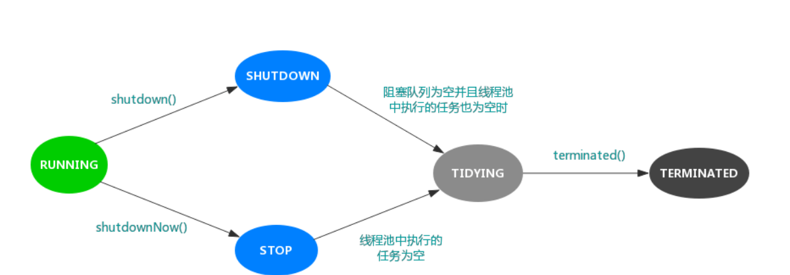

共有七个参数，每个参数含义如下：

corePoolSize

线程池中核心线程的数量。当提交一个任务时，线程池会新建一个线程来执行任务，直到当前线程数等于corePoolSize。如果调用了线程池的prestartAllCoreThreads()方法，线程池会提前创建并启动所有基本线程。

maximumPoolSize

线程池中允许的最大线程数。线程池的阻塞队列满了之后，如果还有任务提交，如果当前的线程数小于maximumPoolSize，则会新建线程来执行任务。注意，如果使用的是无界队列，该参数也就没有什么效果了。

keepAliveTime

线程空闲的时间。线程的创建和销毁是需要代价的。线程执行完任务后不会立即销毁，而是继续存活一段时间：keepAliveTime。默认情况下，该参数只有在线程数大于corePoolSize时才会生效。

unit

keepAliveTime的单位。TimeUnit

workQueue

用来保存等待执行的任务的阻塞队列，等待的任务必须实现Runnable接口。我们可以选择如下几种：

ArrayBlockingQueue：基于数组结构的有界阻塞队列，FIFO。【死磕Java并发】----J.U.C之阻塞队列：ArrayBlockingQueue
LinkedBlockingQueue：基于链表结构的有界阻塞队列，FIFO。
SynchronousQueue：不存储元素的阻塞队列，每个插入操作都必须等待一个移出操作，反之亦然。【死磕Java并发】----J.U.C之阻塞队列：SynchronousQueue
PriorityBlockingQueue：具有优先界别的阻塞队列。【死磕Java并发】----J.U.C之阻塞队列：PriorityBlockingQueue
threadFactory

用于设置创建线程的工厂。该对象可以通过Executors.defaultThreadFactory()，如下：

    public static ThreadFactory defaultThreadFactory() {
        return new DefaultThreadFactory();
    }
返回的是DefaultThreadFactory对象，源码如下：

    static class DefaultThreadFactory implements ThreadFactory {
        private static final AtomicInteger poolNumber = new AtomicInteger(1);
        private final ThreadGroup group;
        private final AtomicInteger threadNumber = new AtomicInteger(1);
        private final String namePrefix;

        DefaultThreadFactory() {
            SecurityManager s = System.getSecurityManager();
            group = (s != null) ? s.getThreadGroup() :
                                  Thread.currentThread().getThreadGroup();
            namePrefix = "pool-" +
                          poolNumber.getAndIncrement() +
                         "-thread-";
        }

        public Thread newThread(Runnable r) {
            Thread t = new Thread(group, r,
                                  namePrefix + threadNumber.getAndIncrement(),
                                  0);
            if (t.isDaemon())
                t.setDaemon(false);
            if (t.getPriority() != Thread.NORM_PRIORITY)
                t.setPriority(Thread.NORM_PRIORITY);
            return t;
        }
    }
ThreadFactory的左右就是提供创建线程的功能的线程工厂。他是通过newThread()方法提供创建线程的功能，newThread()方法创建的线程都是“非守护线程”而且“线程优先级都是Thread.NORM_PRIORITY”。

handler

RejectedExecutionHandler，线程池的拒绝策略。所谓拒绝策略，是指将任务添加到线程池中时，线程池拒绝该任务所采取的相应策略。当向线程池中提交任务时，如果此时线程池中的线程已经饱和了，而且阻塞队列也已经满了，则线程池会选择一种拒绝策略来处理该任务。

线程池提供了四种拒绝策略：

AbortPolicy：直接抛出异常，默认策略；
CallerRunsPolicy：用调用者所在的线程来执行任务；
DiscardOldestPolicy：丢弃阻塞队列中靠最前的任务，并执行当前任务；
DiscardPolicy：直接丢弃任务；
当然我们也可以实现自己的拒绝策略，例如记录日志等等，实现RejectedExecutionHandler接口即可